

  

# BUIKE-HELPDESK: Initial Configuration Walkthrough

**Phase 2 of the Ashgrove Clinic osTicket engagement, Bridgeway Technology**

This phase picks up right after the base install: osTicket and all its dependencies are already running on the VM. Here we configure the actual help desk, roles, SLAs, departments, teams, agents, and help topics, all scoped around a fictional MSP engagement where Bridgeway Technology has been hired to stand up ticketing for Ashgrove Clinic.

---

## Why This Phase Exists

A fresh osTicket install is just a shell. Nothing in it reflects how a real clinic IT department actually runs: who has access to what, how fast a critical outage needs a response versus a routine password reset, and which category a ticket falls into before it ever reaches an agent.

This phase builds that structure out. The goal was to configure osTicket the way an MSP tech would on day one of a real engagement: set up admin access first, then SLAs, then departments, then the people, then the categories tickets get filed under.

---

## Environment

| Component | Detail |
|---|---|
| Platform | Microsoft Azure, Windows Server VM |
| Application | osTicket v1.15.8 |
| Admin persona | chibuike (Devon Ricci, Marcus Bell) |
| Fictional MSP | Bridgeway Technology |
| Fictional client | Ashgrove Clinic |
| Project name | BUIKE-HELPDESK |

---

## What Got Configured

### 1. Roles

**Path:** Admin Panel > Agents > Roles

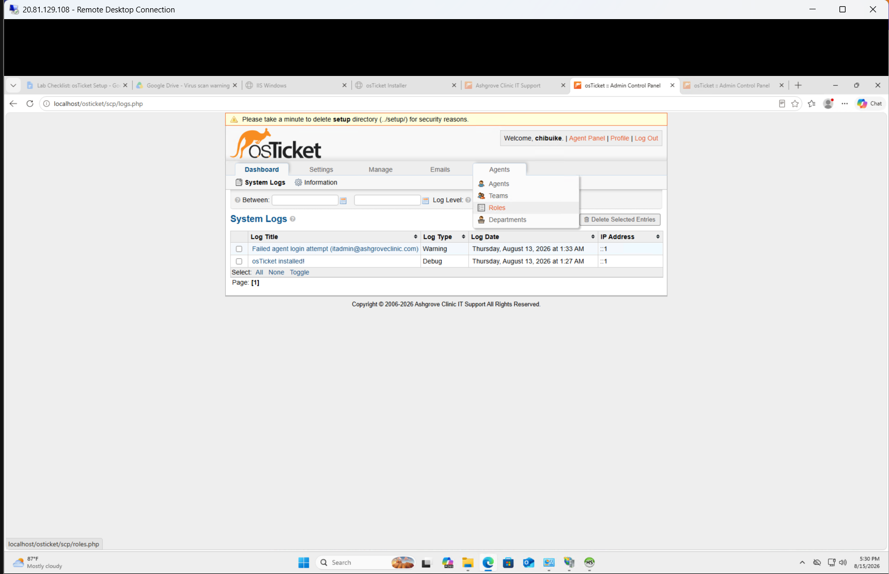

Before adding anything, the built-in roles were reviewed for a baseline: All Access, Expanded Access, Limited Access, Supreme Admin, and View only.

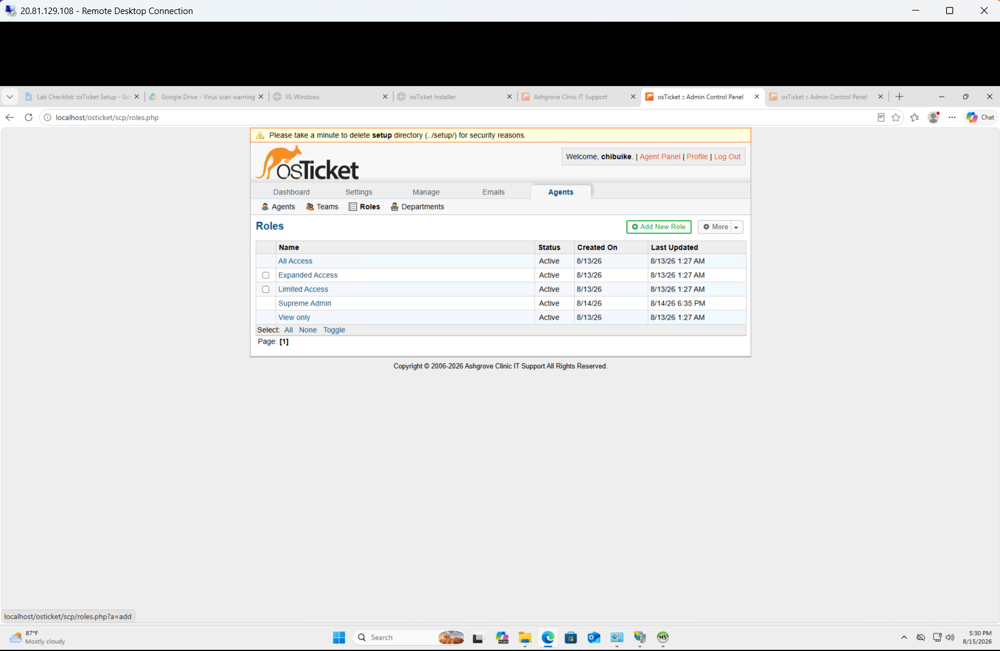

A custom role, IT Director, was created for the person overseeing Clinical IT Support.

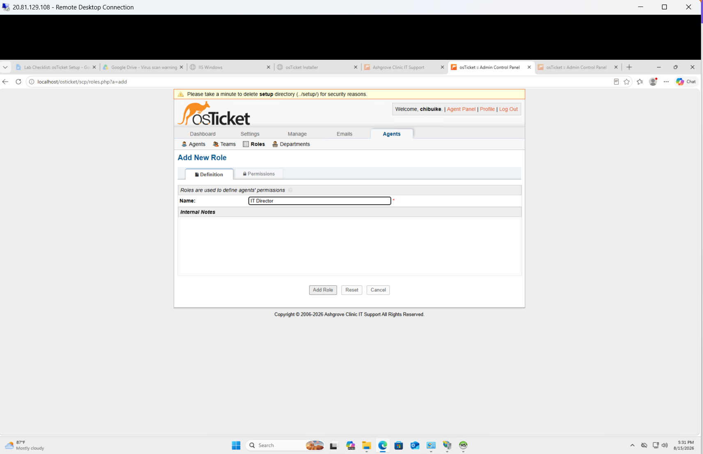

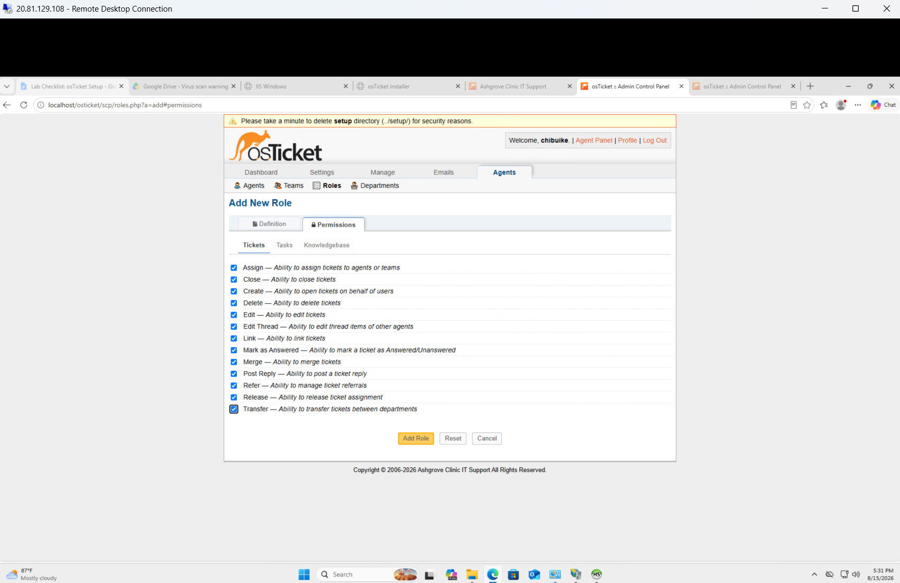

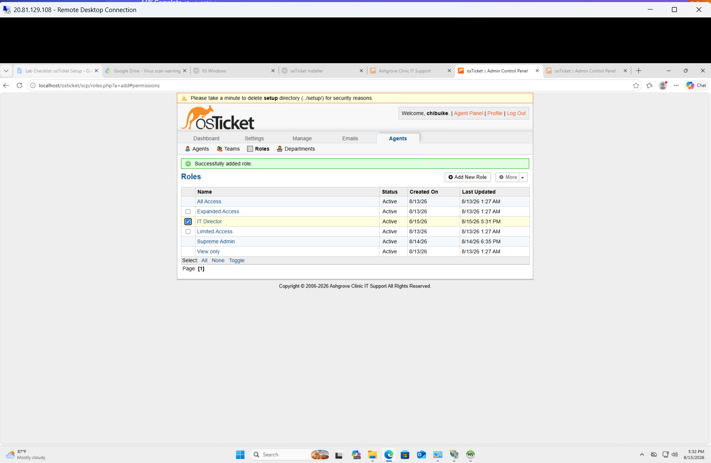

Permissions in osTicket are granted per department, not globally, so the same agent can hold different roles in different departments if they need extended access to more than one.

**Why this came first:** access control has to exist before there's anything to control access to. If departments, agents, or SLAs get built out first, whoever creates them is working under default permissions the whole time, which means going back later to retrofit a proper role onto accounts that already have tickets and history attached. Building the role first means every account created afterward inherits the right level of access from the moment it exists, instead of getting patched after the fact. It also mirrors how a real MSP engagement works: the first thing a technician sets up on a new client's system is who is allowed to touch what, not the workflow itself.

The decision to check every permission for IT Director rather than hand-picking a subset was also deliberate. A View Only or Expanded Access style role would have meant guessing in advance which specific actions the department lead would need, and getting that wrong means a support ticket to fix a role definition instead of an agent fixing a support ticket. Full access at the top of the org chart is the standard pattern in real IT departments too, the constraint usually isn't what the director can do, it's how few people get that role.

### 2. Departments

**Path:** Admin Panel > Agents > Departments

Departments represent the IT support org, not the hospital units requesting help. They control who owns and can see a given ticket.

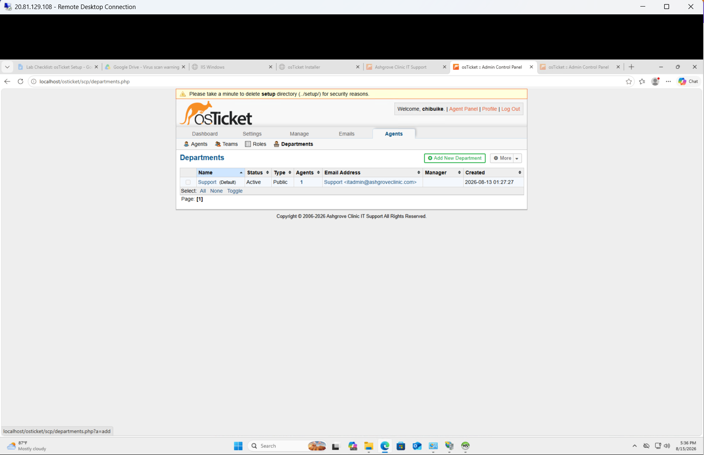

A System Admins department was created and configured underneath Support, with a manager assigned and the schedule set to 24/7.

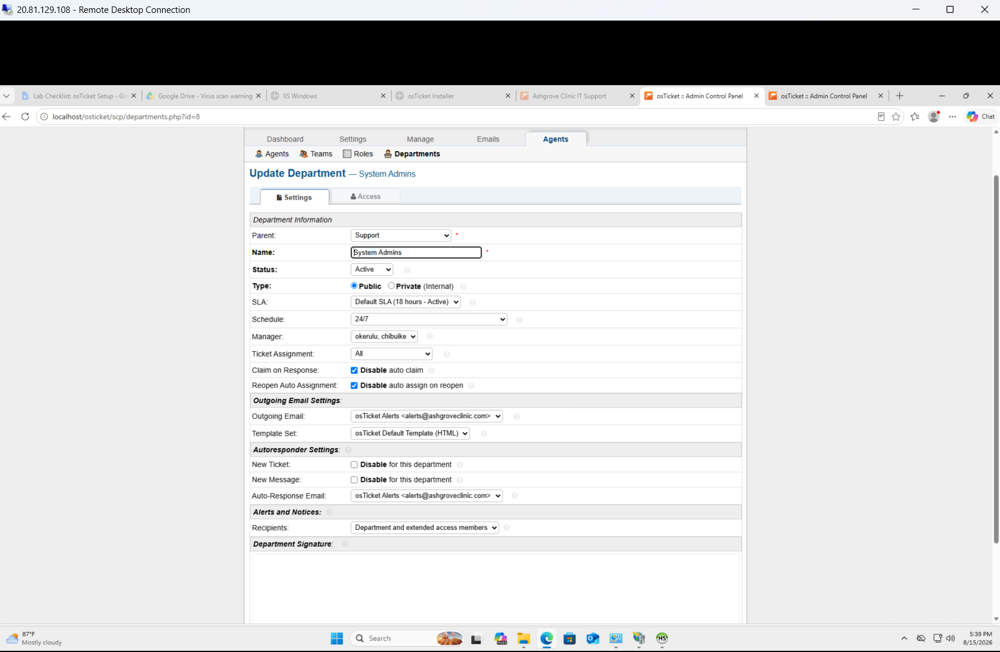

A dedicated department email address was also set up for Clinical IT Support so tickets routed there would send and receive under a distinct identity.

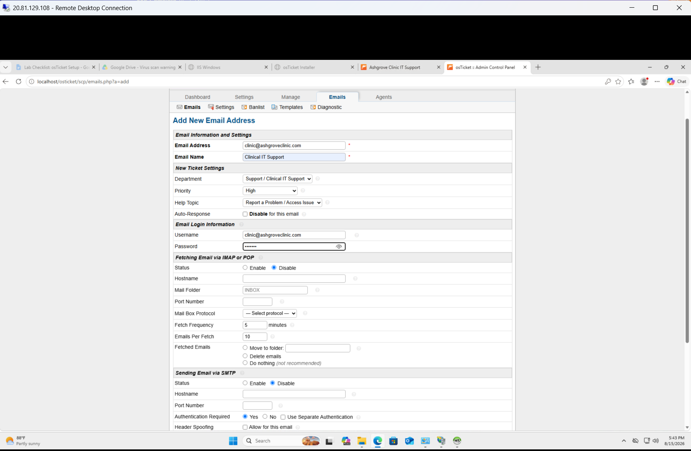

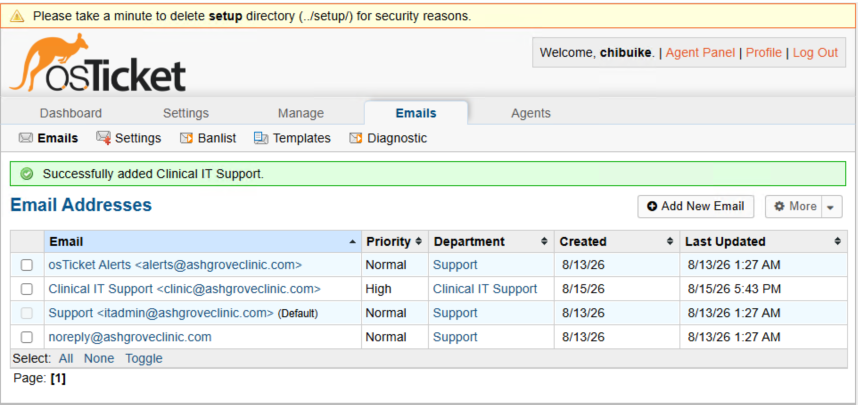

**Why System Admins instead of naming a department after a clinical unit:** the walkthrough this phase is based on calls this out directly, departments in osTicket represent the IT org, not the org being supported. A hospital or clinic has departments like Radiology, Billing, and Front Desk, but none of those are the ones triaging a ticket. Modeling osTicket's departments after the clinic's org chart would mean every ticket needs a human to figure out which clinical unit it's "about" before it can even be filed, when what actually matters for routing is which IT team owns the fix. Keeping System Admins scoped to the support org keeps that judgment call out of the loop entirely, the help topic handles the categorization instead (see Help Topics below), and the department just owns the queue.

**Why a dedicated email address for Clinical IT Support:** the default Support address is a generic catch-all. Giving Clinical IT Support its own address at High priority means any mail that comes in through that channel is already flagged as urgent before an agent even opens it, and outbound replies from that department carry a distinct, recognizable sender identity instead of blending in with general support traffic. In a real clinic, that separation matters more than it looks like it should, an EHR-down email and a "how do I reset my portal password" email should never be sitting in the same undifferentiated inbox waiting to be read in order.

### 3. Teams

**Path:** Admin Panel > Agents > Teams

Teams group agents across departments, useful when a group needs shared visibility into a category of issue regardless of their primary department. A Clinical Systems Support team was created to represent Clinical IT Support staff plus help desk agents who jointly handle tickets tied to patient-facing systems.

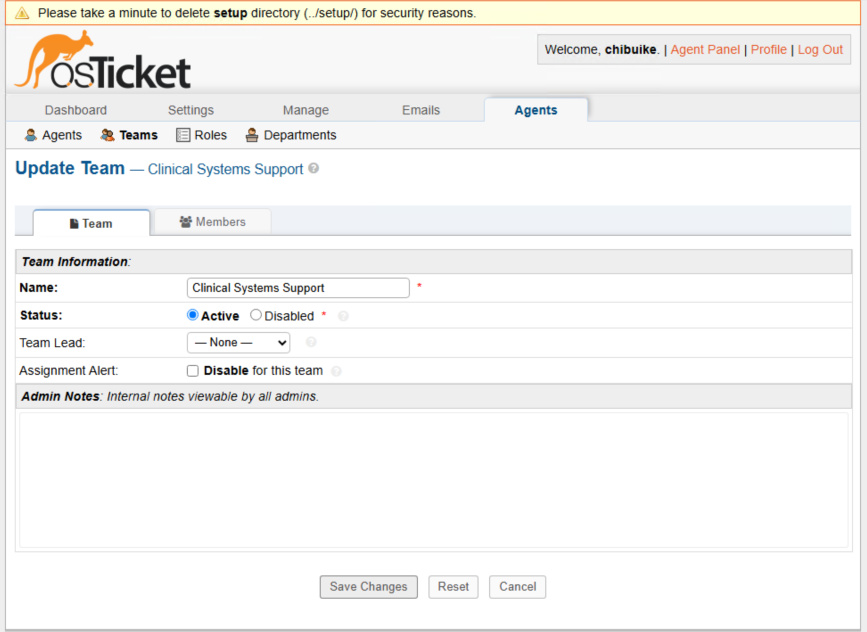

**Why teams exist separately from departments:** departments and teams solve two different problems, and collapsing them into one thing is a common mistake when someone is setting up a help desk for the first time. A department answers "who owns this ticket." A team answers "who else needs eyes on it." Clinical Systems Support exists because a ticket about the AD-authenticated patient portal, for example, might get filed and owned by Clinical IT Support, but a System Admins agent handling directory services also needs visibility into it without having ownership transferred to them. Without a team, that agent either has to be pulled into the department outright, which grants them more than visibility, or they simply don't see the ticket until someone thinks to loop them in manually. The team layer lets access follow the category of problem instead of the org chart.

### 4. Agents

**Path:** Admin Panel > Agents > Add New

Two agent accounts were created: Devon Ricci as IT Director over Clinical IT Support, and Marcus Bell as a View Only agent under the default Support department.

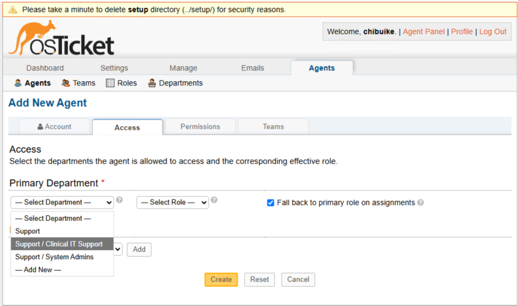

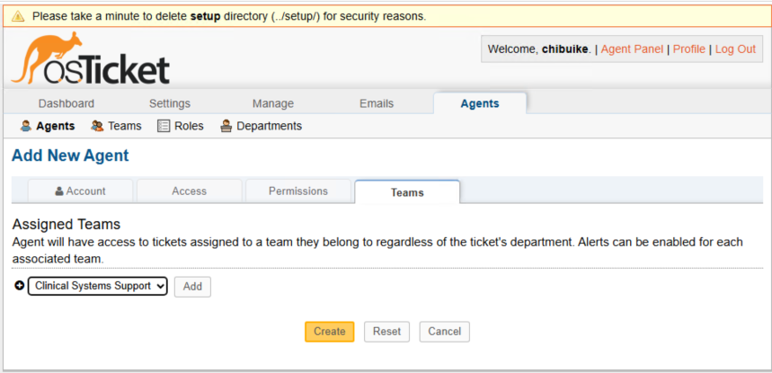

After each agent was created, their password was set separately through the agent's profile.

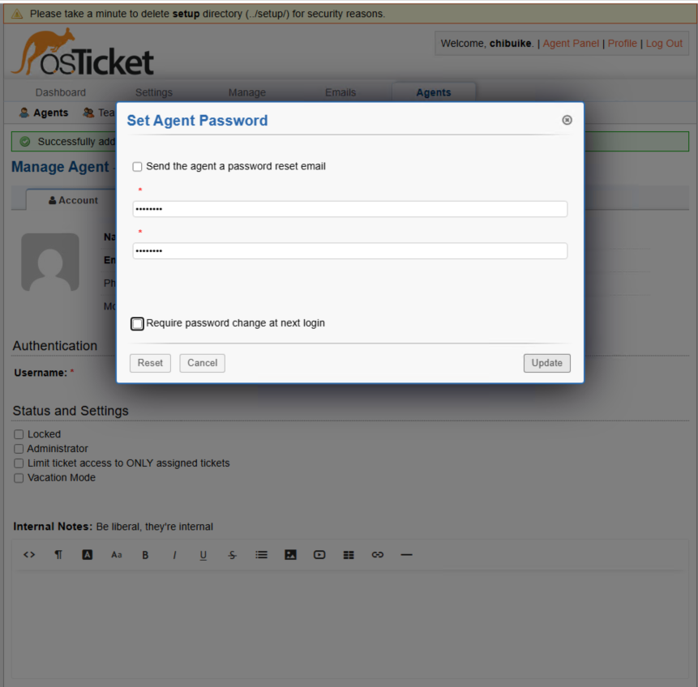

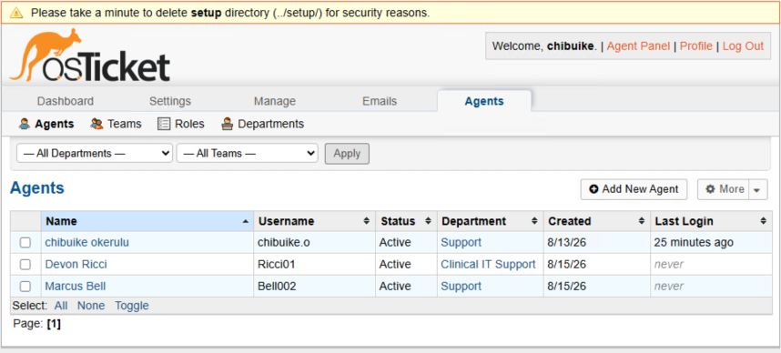

**Why two agents with deliberately different access levels:** a help desk with only administrator accounts doesn't actually prove anything about how permissions work, it just proves the installer succeeded. Devon Ricci was built as the IT Director over Clinical IT Support specifically to sit at the top of the access model created earlier, full ticket permissions, primary ownership of the clinical queue, and membership on the cross-department team. Marcus Bell was built as the opposite case on purpose, a View Only agent under the default Support department, to represent a junior hire, a contractor, or anyone who needs to see ticket activity without being able to act on it. Having both accounts live at once means the role and department configuration from earlier steps can actually be checked against real behavior instead of taken on faith.

**Why the password gets set in a separate step:** osTicket's account creation flow and its password flow are intentionally split. Setting the password afterward, through the agent's own profile, matches how account provisioning tends to work in a real environment, an account gets created with baseline access first, then credentials get issued and handed off separately, sometimes by a different person entirely. It also leaves the option open to send a password reset email instead of setting one directly, which is closer to how a real MSP would onboard a client's staff.

### 5. SLAs

**Path:** Admin Panel > Manage > SLA

Three SLA tiers were built around patient impact rather than generic severity labels, all running against the default 24/7 schedule created for this phase.

| SLA | Grace Period | Use Case |
|---|---|---|
| Sev A | 1 hour | Critical outages affecting patient care systems |
| Sev B | 4 hours | Significant disruption, not directly patient-facing |
| Sev C | 8 hours | Routine requests, password resets, general support |

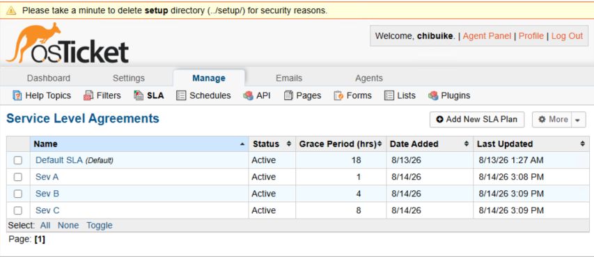

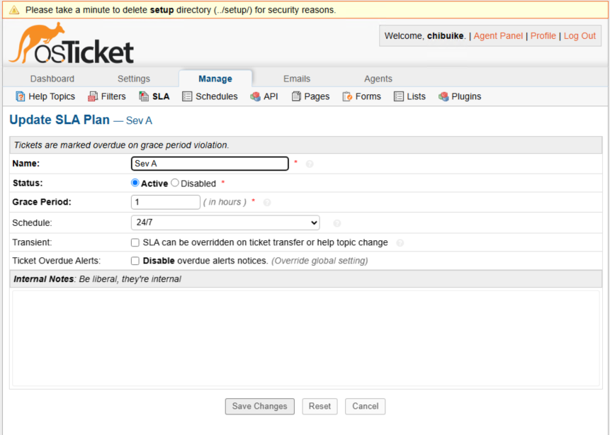

**Why patient impact instead of generic severity labels:** "High, Medium, Low" tells an agent nothing about what's actually at stake, it just ranks tickets against each other without saying why. Naming the tiers Sev A, Sev B, and Sev C and defining each one by what it means for patient care forces the grace period to be justified by a real scenario instead of a gut feeling about urgency. A 1 hour grace period on Sev A isn't arbitrary, it's what "the EHR is down and clinicians can't chart" actually demands. That framing also makes the tiers easier to defend later, if someone asks why a ticket is Sev A instead of Sev B, the answer is about what broke, not about a subjective priority label.

**Why 24/7 for all three tiers instead of business hours:** a clinic doesn't stop needing IT support at 5 PM the way a typical office might. Even the lowest tier here, Sev C, still needs to be reachable outside business hours because a locked-out login or a broken workstation can happen on any shift, healthcare runs around the clock. The tradeoff of an always-on grace period is deliberate, it means the SLA clock never pauses to give an artificially generous buffer, which keeps the numbers honest.

### 6. Help Topics

**Path:** Admin Panel > Manage > Help Topics

Help topics are the categories hospital staff choose when submitting a ticket, and they can auto-route tickets to a department, priority, and SLA plan.

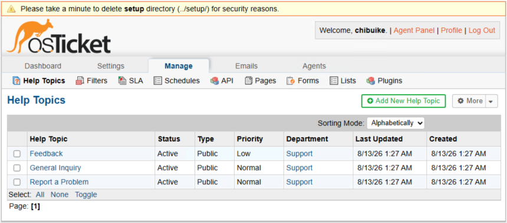

A Critical System Outage topic was added first, since it needed the fastest routing of the group.

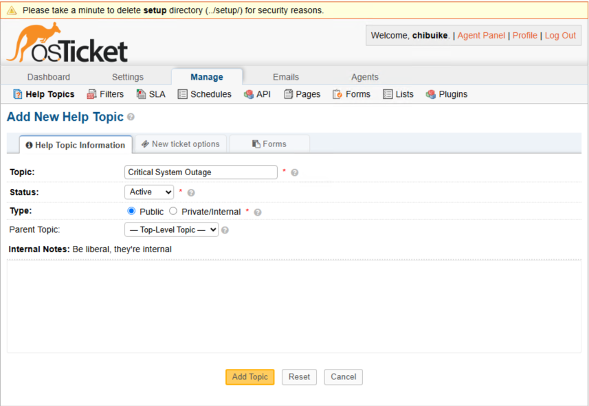

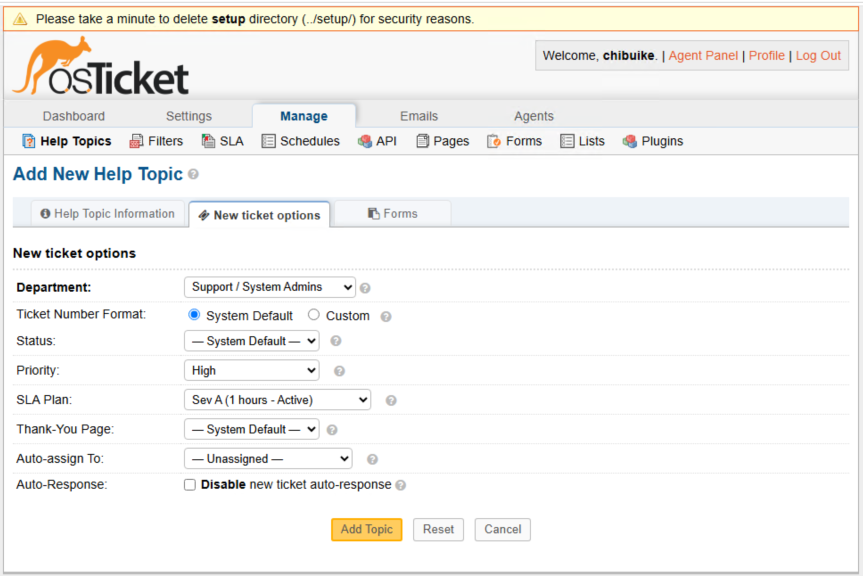

A Workstation / PC Issue topic was added underneath Report a Problem as a sub-topic, since it's a specific flavor of a broader complaint category.

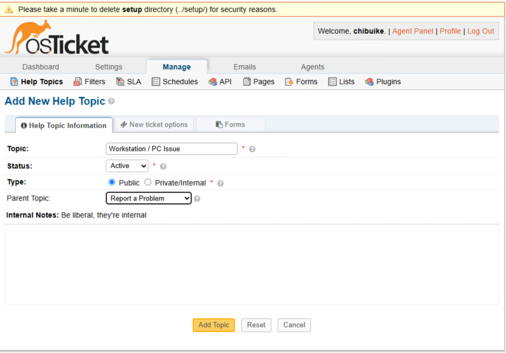

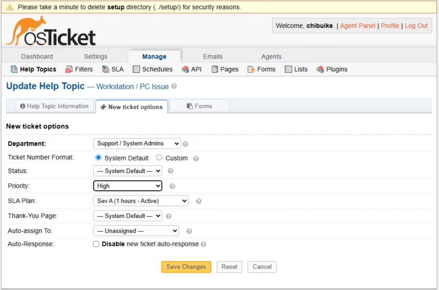

An Equipment Request topic rounded out the set, routed at a lower urgency since it isn't tied to an active outage.

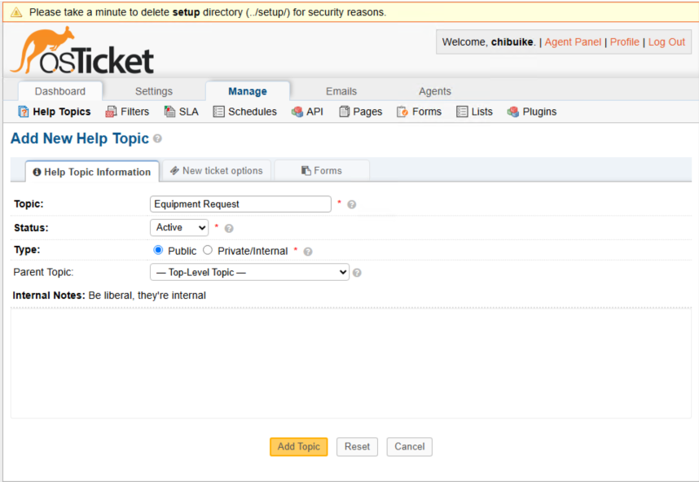

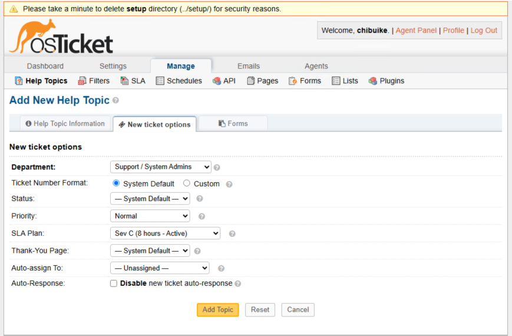

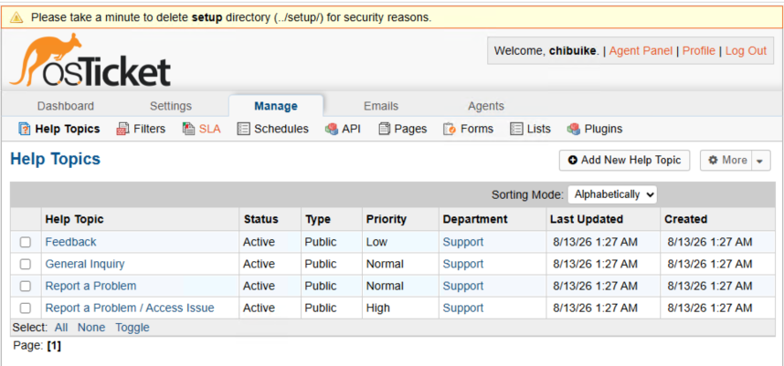

**Why Critical System Outage got built first:** with three topics to add, the order wasn't arbitrary. Building the highest-urgency topic first means the routing rules for the worst-case scenario exist before anything lower-priority does, so there's never a window where a critical outage could come in and fall through to a default topic with no SLA attached. It also mirrors the sequence the SLA tiers were built in, define the worst case, then work down.

**Why Workstation / PC Issue is a sub-topic instead of standalone:** nesting it under Report a Problem keeps the top-level list from growing into a flat pile of overlapping categories. A workstation issue is a kind of problem report, not a separate class of ticket, so giving it a parent topic keeps that relationship visible in the structure itself instead of just in someone's head. It also means Report a Problem can hold other sub-topics later without needing to reorganize what's already there.

**Why Equipment Request sits at Sev C instead of a dedicated tier:** not every ticket needs a bespoke SLA, and manufacturing urgency where none exists undermines the tiers that actually need to mean something. A request for a new monitor or a spare keyboard doesn't carry any patient-impact risk, so it gets folded into the same 8-hour, business-general tier as routine requests like password resets. Keeping the low-urgency tickets pooled together is what keeps Sev A meaningful, if everything were tagged as urgent, the fast SLA would stop signaling anything.

**Why each topic sets its own priority and SLA instead of inheriting from the department:** System Admins owns all three of these topics, but they don't all carry the same urgency. If priority and SLA were only set at the department level, Critical System Outage and Equipment Request would be forced to share a single grace period despite representing completely different levels of risk. Setting these fields per topic means the department defines who owns the queue, and the topic defines how fast that specific kind of ticket needs to move, which keeps ownership and urgency as two separate decisions instead of one.

### 7. Branding

**Path:** Admin Panel > Settings > Company > Logos

Once the core configuration was in place, the default osTicket branding was swapped out for a custom Ashgrove Clinic logo, replacing the generic Support Center wordmark that ships with the system out of the box.

The Logos tab under Company Profile splits the setting into two independent choices, one for the Client-facing portal and one for the Staff control panel, each pointed at either the system default logo or a custom upload. For this build, the client-facing view was set to use the custom Ashgrove Clinic logo, while the system default stayed selected for Staff, keeping the visual distinction between the two panels intact.

**Why this matters:** a generic Support Center wordmark is fine for a lab environment, but it breaks the illusion the moment a hospital staff member opens the client portal expecting to see their own organization's branding. Swapping in the Ashgrove Clinic logo for the client-facing side is a small change, but it is the kind of detail that separates a raw osTicket install from something that reads as a real, client-ready deployment, which matters for how this project holds up in a portfolio review.

**Why Staff kept the system default:** agents and admins already know they're working inside osTicket, so there's no functional reason to rebrand the internal panel. Reserving the custom logo for the client-facing side keeps the change purposeful instead of cosmetic for its own sake, the branding follows whoever actually needs to see it, which in this case is Ashgrove Clinic staff submitting tickets, not the Bridgeway technicians working them.

---

## Build Phases

1. Reviewed built-in roles, then built a custom IT Director role with full ticket permissions
2. Created the System Admins department and a dedicated Clinical IT Support email address
3. Created the Clinical Systems Support team for cross-department visibility
4. Created Devon Ricci (IT Director, Clinical IT Support) and Marcus Bell (View Only, Support), setting passwords separately after account creation
5. Built out three SLA tiers (Sev A, Sev B, Sev C) framed around patient impact
6. Added Critical System Outage, Workstation / PC Issue, and Equipment Request help topics, each routed to a department, priority, and SLA plan
7. Replaced the default client-facing logo with a custom Ashgrove Clinic logo, keeping Staff on the system default

---

## Recap

By the end of this phase:

- An IT Director role exists with full ticket permissions
- A System Admins department and a Clinical IT Support email address are configured
- A Clinical Systems Support team exists for cross-department ticket visibility
- Two agents are active: Devon Ricci (IT Director) and Marcus Bell (View Only)
- Three SLA tiers are live: Sev A (1hr), Sev B (4hr), and Sev C (8hr), all on a 24/7 schedule
- New help topics route tickets by patient impact: Critical System Outage and Workstation / PC Issue at Sev A, Equipment Request at Sev C
- The client-facing portal now displays a custom Ashgrove Clinic logo, while Staff remains on the system default

**Next step:** creating and working mock tickets, submitting as an end user, then triaging, assigning, and resolving as an agent.

---

*Bridgeway Technology, Ashgrove Clinic engagement*
